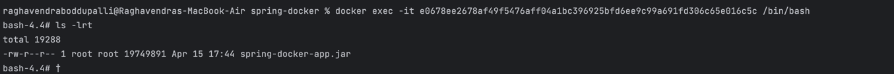

See list of images available:
* docker images.

Build a docker image:
* Docker build -t <image-name>:<version number>
* By Default docker will fetch dependencies from local, if not available it will fetch from docker hub.

Run a docker image in Container.
* docker run -d -p 9090:8282 <image-name>:<version number>
* Example : docker run -d -p 8282:8282 spring-docker-app:1.0
* -d = detachable mode
* -p =  port
* In above example, when the user hits a request with port number 9090 of host machine, redirect it to port 8282 in the docker container.

To see list of Docker containers
* docker ps

To see container logs
* docker logs <container id>

To access files inside the container
* docker exec -it <container id> <path to access>
* it = integrated terminal
* 

To Create the docker image with JIB. Follow the below article
* https://codippa.com/gradle-docker-images/
* https://medium.com/@ujjawalr/build-docker-images-with-gradle-jib-plugin-6ce29543beb5